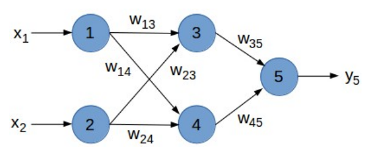

## Beispiel zur Verwendung der Funktionalität

Netz erstellen über net.get_net(anz_neurons, func, func_derivation=None)  
anz_neurons: List/Tupel der Anzahl der Neuronen pro Schicht  
func: Übertragungsfunktion
func_derivation: Ableitung der Übertragungsfunktion, nur für Backpropagation nötig

### Rückgabewert = Dictionary mit:
- "f": Funktionen (Dictionary)  
- "f_der": Ableitungen (Dictionary)  
- "layers": Anzahl der Layer  
- "anz": Anzahl der Neuronen pro Schicht (Liste)  
- "w": Gewichte zwischen Neuronen (Dictionary)  
- "b": Bias der Neuronen (Dictionary)  

---

#### Name eines Neurons:  
Layer (0-n) + Nummer (1-n)  

Bsp.:
- 1: "01"
- 2: "02"
- 3: "11"
- 4: "12"
- 5: "21"

#### Name eines Gewichts/Verbindung:  
Verbindungslayer (1-n) + Nummer von (1-n) + Nummer nach (1-n)

Bsp.:
- w13: "111"
- w14: "112"
- w23: "121"
- w24: "122"
- w35: "211"
- w45: "221"

---

### Gewichte und Bias initialisieren
#### net_set_weight(net, weights)
- net: Netz
- weights: Gewichte nach dem Schema    

Liste aller "Ebenen-Verbindungen"  
mit einer Liste aller Start-Knoten  
mit einer Liste der Gewichte zu allen Zielknoten  
[[[0.5, 0.9], [0.4, 1.0]], [[-1.2], [1.1]]]  
_w13_w14_w23_w24_w35__w45

#### net_set_bias(net, biases)
- net: Netz
- biases: Bias-Werte nach dem Schema  

Liste aller Ebenen (ohne erste)  
mit Liste der Bias-Werte der Neuronen  
[[-1, -2], [-3]]  
_3__4___5